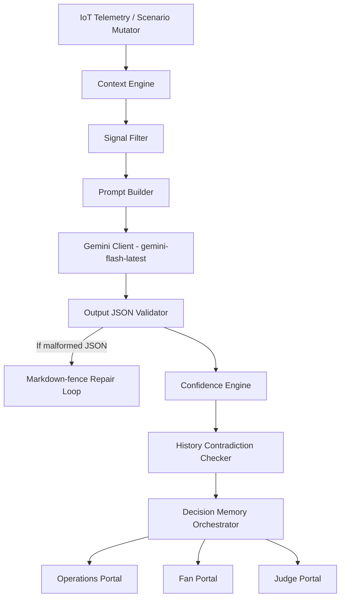

# Ω ARENAMIND
> **One Truth. Many Perspectives.**

[](https://nextjs.org/)
[](https://react.dev/)
[](https://threejs.org/)
[](https://expressjs.com/)
[](https://ai.google.dev/)
[](https://www.typescriptlang.org/)

ArenaMind is an AI-powered operational decision intelligence platform designed for large-scale sporting and entertainment venues. Developed to enhance match-day logistics, spectator routing, and incident response, ArenaMind bridges the gap between raw Internet-of-Things (IoT) telemetry and trustworthy human actions.

---

## 2. The Problem
Managing a high-capacity stadium during a live match involves juggling thousands of concurrent signals—such as changing weather fronts, public transit delays, medical incidents, and sudden crowd surges at entry gates. Stadium operators struggle with a "coordination gap" where raw telemetry remains isolated, leading to delayed decision-making, while fans lack reliable navigation advice and regulators lack visibility into the AI models coordinating the venue's safety.

---

## 3. The Solution
ArenaMind establishes a shared state of operational truth, processed through a multi-stage AI Reasoning Pipeline, and served to three distinct user portals:
1. **Operations Portal**: A real-time command console enabling stadium directors to trigger mock weather/crowd scenarios, monitor live queues, and dispatch AI-recommended security briefs.
2. **Fan Portal**: A mobile-first, warm-accented companion app providing fans with step-free navigation, shuttle schedules, parking vacancy meters, and an interactive AI Assistant.
3. **Judge Portal**: An explainability and compliance dashboard exposing the exact prompt structures, grounding signals, raw API outputs, and deterministic confidence calculations behind every AI action.

---

## 4. Live Demo
The platform is deployed live at: **[DEPLOYED_URL_HERE]**

### How to Explore the Demo
*   **Step 1 (Operations)**: Navigate to `/operations`. Trigger a scenario in the *Simulation Controls* (e.g. "Crowd Surge" or "Heavy Rain") and watch the live 3D Stadium Twin update, while a tailored AI Decision Brief generates dynamically in the sidebar.
*   **Step 2 (Fan)**: Open `/fan` to view the mobile-adapted dashboard. Inspect the *Amenities Finder*, *Live Transit Table*, and chat with the *AI Guide Assistant* to see how the AI guides fans away from surging gates.
*   **Step 3 (Judge)**: Visit `/judge` to access the full Explainability Center. Pick the generated decision from the table logs to inspect its raw prompt context, evidence-grounding matches, validation errors, and confidence factor breakdown.

---

## 5. Key Features

*   **Interactive 3D Stadium Twin**: A camera-orbitable WebGL stadium model built with React Three Fiber. Features 4 stepped seating stand tiers (North blue, South green, East amber, West red), detailed corner floodlight arrays, and 3D gateway doorway frames that glow dynamically matching real-time risk states.
*   **Dynamic Weather Particles**: A procedural rain drop and dense fog particle engine that reacts instantly to weather inputs.
*   **Multi-Stage AI Reasoning Pipeline**: Passes raw telemetry through a validation loop (Grounding → Prompt Builder → Gemini Client → Output Validator → Confidence Engine → Decision Memory).
*   **Explainable Confidence Engine**: Calculates a deterministic, human-auditable score (0-100) based on clear performance metrics instead of using black-box estimates.
*   **Three Tailored Portals**: One centralized Express server serves the same mock IoT database to three purpose-built NextJS portal layouts.

---

## 6. Architecture Overview



---

## 7. Tech Stack

| Layer | Technology | Version / Model |
| :--- | :--- | :--- |
| **Frontend** | Next.js (App Router), React, Tailwind CSS | Next 16.2.10, React 19.2.4 |
| **3D Rendering** | Three.js, React Three Fiber, Drei | Three 0.185.1, R3F 9.6.1, Drei 10.7.7 |
| **Backend** | Node.js, Express, TypeScript, CORS | Node 20+, Express 4.19.2 |
| **AI Orchestration** | Google Generative AI Node.js SDK | @google/generative-ai 0.24.1 |
| **AI Model** | Gemini Flash API | `gemini-flash-latest` (Gemini Flash 2.0 / 2.5) |

---

## 8. Running Locally

### Prerequisites
*   Node.js (v20 or higher)
*   A Google Gemini API Key (obtained from Google AI Studio)

### Step-by-Step Setup

1. **Clone the Repository**
   ```bash
   git clone https://github.com/[username]/arenamind.git
   cd arenamind
   ```

2. **Configure the Backend**
   ```bash
   cd backend
   cp .env.example .env
   ```
   Open the `.env` file and input your Gemini API Key:
   ```env
   PORT=5000
   GEMINI_API_KEY=your_gemini_api_key_here
   ```
   Install dependencies and start the backend development server:
   ```bash
   npm install
   npm run dev
   ```
   The backend server will launch on `http://localhost:5000`.

3. **Configure the Frontend**
   In a new terminal window:
   ```bash
   cd ../frontend
   npm install --legacy-peer-deps
   npm run dev
   ```
   The frontend Next.js development server will launch on `http://localhost:3000`.

---

## 9. Project Structure

```
arenamind/
├── backend/
│   ├── src/
│   │   ├── data/            # Mock IoT databases (gates, weather, transit)
│   │   ├── engine/
│   │   │   ├── reasoning/   # prompt-builder.ts, gemini-client.ts, confidence-engine.ts
│   │   │   └── validator/   # json-schema output-validator.ts
│   │   └── index.ts         # Express server routing
│   └── package.json
├── frontend/
│   ├── app/
│   │   ├── (operations)/    # Operator control center (/operations)
│   │   ├── (fan)/           # Spectator guide app (/fan)
│   │   ├── (judge)/         # AI Explainability Center (/judge)
│   │   └── page.tsx         # Split Landing page with 3D Twin embed
│   ├── components/
│   │   ├── atoms/           # Base UI primitives (buttons, badges)
│   │   └── organisms/       # StadiumTwinDiagram.tsx, OperationsSidebar.tsx
│   └── package.json
└── README.md
```

---

## 10. Design Philosophy
The visual aesthetics and UI flow of ArenaMind follow six core principles:
1.  **Clarity over Complexity**: High-density operational data presented without clutter.
2.  **Explainability over Mystery**: Exposing the inner workings of decisions rather than hiding them.
3.  **Consistency over Novelty**: Adhering to the established design system tokens (spacing, borders, elevation).
4.  **Accessibility by Default**: Aria labels, semantic landmarks, keyboard fallbacks, and screen-reader alternatives.
5.  **Human-Centered AI**: AI is a recommender; humans verify, dispatch, or reject.
6.  **Professional Craftsmanship**: Smooth CSS micro-animations, glowing status indicators, and clean layout proportions.

---

## 11. What Makes This Different
Rather than wrapper-style AI implementations, ArenaMind focuses on architectural rigor:
*   **Deterministic Confidence Calculations**: Evaluated mathematically out of 100 points:
    *   `Evidence Unmatched`: `-15` per hallucinated entity.
    *   `Gemini Retry Needed`: `-10` points.
    *   `Sparse Input Signals`: `-15` points.
    *   `Urgency Mismatch Check`: `-20` points if AI claims a critical threat when inputs are safe.
    *   `Response Format Repair`: `-5` points.
    *   `Strong Grounding evidence`: `+10` points for 3+ matched signals.
*   **JSON-Schema Recovery**: Automatically detects missing markdown code fence wrappers or trailing characters and strips them before passing to the parser.
*   **Contradiction Checking**: Scans the session decision log to flag logic contradictions (e.g. recommending gate closures when previous logs state the walkway is clear).

---

## 12. Team / Acknowledgments
ArenaMind was built for the **Google for Developers PromptWars Hackathon (Challenge 4)**. 

*AI-assisted pair-programming was intentionally leveraged in the design and implementation of the 3D graphics, responsive containers, and pipeline verification tests.*
