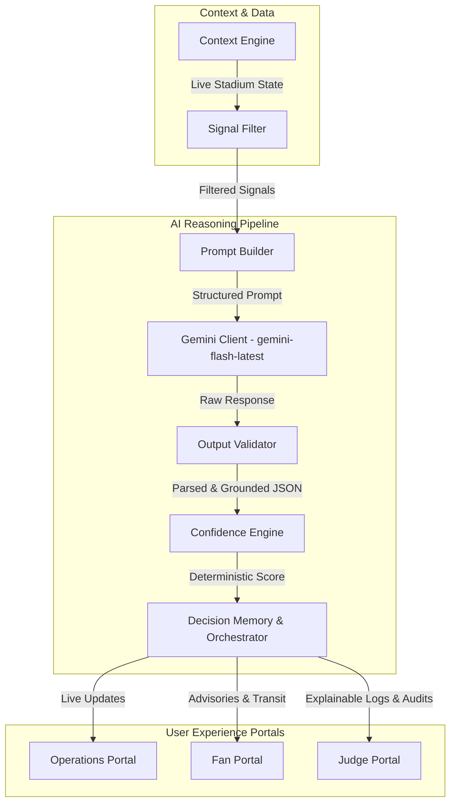

# Ω ARENAMIND

> **One Truth. Many Perspectives.**  
> Real-time Digital Stadium Twin and AI Decision Intelligence engine keeping matches safe, smooth, and predictable.

[](https://nextjs.org/)
[](https://www.typescriptlang.org/)
[](https://expressjs.com/)
[](https://deepmind.google/technologies/gemini/)
[](https://threejs.org/)
[](https://arenamind-zeta.vercel.app)
[](https://arenamind-kv64.onrender.com)

---

## Demo Video

Watch a full walkthrough of all three portals, the AI reasoning pipeline, and the 3D Digital Twin in action.

[](https://youtu.be/mUexi9SoNW0)

---

## The Problem

Large stadium events (with 50,000+ attendees) suffer from fragmented communication and slow reaction times during critical incidents. Staff coordinates via radios, fans navigate blindly, and command centers operate on delayed, flat spreadsheets. When queue times spike or elevators fail, there is no single source of truth connecting operations, safety compliance, and direct spectator flow.

## The Solution

**ArenaMind** bridges this gap by unifying live stadium telemetry into a singular data model consumed across three distinct, user-focused portals:

1. **Digital Stadium Twin:** A high-fidelity, real-time 3D telemetry layout built in React Three Fiber mapping gate queues, risks, and incident reports.
2. **AI Reasoning Pipeline:** An explainable, multi-stage pipeline utilizing Gemini to translate raw signals (weather, queues, breakdowns) into grounded, structured operational decisions.
3. **Three-Portal Architecture:** Consistently driven by one state:
   - **Operations Portal** for event command control room operators.
   - **Fan Portal** for mobile-first spectator wayfinding and transit updates.
   - **Judge Portal** for explainable AI auditing and structural telemetry tracking.

---

## Live Demo

- **Frontend Application (Vercel):** [arenamind-zeta.vercel.app](https://arenamind-zeta.vercel.app)
- **Backend API Server (Render):** [arenamind-kv64.onrender.com](https://arenamind-kv64.onrender.com)
  *(Note: The backend runs on Render's free tier. If the service is idle, it may take 30–60 seconds to spin up on first request.)*

### Try It Yourself:
- **Operations Room (`/operations`):** Trigger a gate incident or mutation in the *Incident Center* or *Live Decisions* page, and watch it propagate instantly across the system.
- **Fan Portal (`/fan`):** Open the mobile view to check live transport advisories, navigate layout gates, and receive real-time queue notices.
- **Auditor Dashboard (`/judge`):** Deep-dive into prompt schemas, inspect the raw Gemini response payloads, and track exactly how the Confidence Engine calculated its audit parameters.

---

## Key Features

- **3D Telemetry (React Three Fiber):** Live, orbitable 3D stadium layout visualizer showing real-time gate occupancy colors, weather fog, dynamic rain, and selection indicators. Gracefully downgrades to 2D vector layouts if WebGL is unavailable.
- **Signal Filter & Prompt Builder:** Strips out-of-context telemetry data so only relevant localized parameters (affected gate risk, nearby incident, available zone volunteers) are injected into the Gemini prompt context window.
- **Deterministic Confidence Engine:** Transparency over black-box AI scores. Scores start at base 100 with clear, code-defined scoring penalties and bonuses:
  - `-15` per ungrounded evidence item (possible hallucination)
  - `-10` for transient API retries
  - `-15` for sparse signal coverage (low operational data)
  - `-20` for urgency mismatches (critical severity claims lacking supporting high/critical signals)
  - `+10` bonus for strong corroborating evidence (3+ matched signals)
- **Contradiction Detection:** Checks incoming Gemini recommendations against the previous decision briefs saved in memory to detect instructions that run counter to recent commands (e.g. telling fans to go to Gate C when it was closed due to an active incident).

---

## Architecture Overview



---

## Tech Stack

| Layer | Technologies |
|---|---|
| **Frontend** | React, Next.js 14 (App Router), TailwindCSS, Lucide Icons |
| **3D Rendering** | Three.js, React Three Fiber (R3F), `@react-three/drei` |
| **Backend** | Node.js, Express 4, TypeScript 5, `dotenv`, `cors` |
| **AI / Reasoning** | `@google/generative-ai` (Model: `gemini-1.5-flash` via AI Studio API) |
| **Deployment** | Vercel (Frontend), Render (Backend Engine) |

---

## Running Locally

### 1. Prerequisites
- **Node.js** 20.x or later installed
- **Gemini API Key** from [Google AI Studio](https://aistudio.google.com/)

### 2. Installation
Clone the repository:
```bash
git clone https://github.com/your-username/arenamind.git
cd arenamind
```

#### Backend Setup
```bash
cd backend
npm install
```
Create a `.env` file in the `backend/` directory:
```env
PORT=4000
GEMINI_API_KEY=your_gemini_api_key_here
```
Start the development backend:
```bash
npm run dev
```

#### Frontend Setup
```bash
cd ../frontend
npm install
```
Create a `.env.local` file in the `frontend/` directory:
```env
NEXT_PUBLIC_API_URL=http://localhost:4000
```
Start the development frontend:
```bash
npm run dev
```
Open [http://localhost:3000](http://localhost:3000) to view the app.

---

## Project Structure

```
arenamind/
├── backend/
│   ├── src/
│   │   ├── engine/          # Context engine, reasoning pipeline, confidence scoring
│   │   ├── routes/          # Express API route declarations
│   │   ├── data/            # Stadium seed data (stadium-state.json)
│   │   └── index.ts         # Server entry point
│   └── package.json
└── frontend/
    ├── app/                 # Next.js App Router (Operations, Fan, Judge portals)
    ├── components/          # Atom/Molecule/Organism UI elements (Three.js scene)
    ├── context/             # React State & Polling Providers
    └── package.json
```

---

## Design Philosophy

- **Clarity over complexity:** Direct focus on telemetry updates and real-time responsiveness.
- **Explainability over mystery:** Open auditing of prompts, model inputs, and confidence breakdowns.
- **Consistency over novelty:** Universal UI layouts, shared tokenized variables, and structured components.
- **Accessibility by default:** Direct keyboard selection overrides and screen-reader parallel structures alongside the 3D twin.
- **Human-centered AI:** AI operates as a supportive recommendation engine; human operators retain decision control.
- **Professional craftsmanship:** Premium dark-elevated dashboard styling utilizing tailored alpha-blended tokens.

---

## What Makes This Different

- **Deterministic Verification:** The Output Validator parses and compares the output JSON schema and checks every piece of claimed "evidence" directly against active database values. Hallucinations are actively caught and logged as score deductions rather than propagating to operators.
- **WebGL Memory Management:** The 3D stadium layout uses lazy loading, memoized component trees, and explicit GPU resource disposal (disposes of geometries, canvas textures, and point structures on unmount) preventing the typical memory leaks and "Context Lost" errors associated with frequent live polling re-renders.
- **Resilient Fallback Mode:** Seamless auto-detection of device capabilities. If the user's browser lacks WebGL, the system dynamically swaps the canvas out for an SVG-rendered 2D twin that matches the operations telemetry model exactly.

---

## Acknowledgments

Built solo by **Lolaa M H** for the **Google for Developers PromptWars Hackathon (Challenge 4)**.
